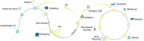

```{r setup, include=FALSE}

knitr::opts_chunk$set(echo = FALSE,  include=FALSE, warning = FALSE, message = FALSE)

source("www/partials/00-config.R")
source("www/partials/01-databases.R")
source("www/partials/02-global-description.R")
source("www/partials/03-goals.R")
source("www/partials/04-matrix-impact.R")
source("www/partials/05-global-matrix-impact.R")
source("www/partials/06-indepth-analysis.R")

```


# Goal {.sidebar data-icon="fa-signal"}
**Goal of WP 4.1 :**

> The main purpose of task 4.1 is to describe and define the needs of each demonstrator in order to establish a common base. Thus, each physical demonstrator shall be observed, and specific data of the processes shall be collected with the purpose to create a holistic framework of open manufacturing demonstration facility.


<a href = "https://erpi.univ-lorraine.fr/">Made by Université de Lorraine</a>


# DIT {data-icon="fa-bullseye"}
## Row {.tabset .tabset-fade}
### Global DIT process



### Interactive DIT Process
```{r child = "www/partials/DIT/01-figure-interactive.Rmd"}
```

### Specific DIT Process
```{r child = "www/partials/Specific-DIT.Rmd"}
```


# Global analysis {data-icon="fa-diagnoses"} 
## Row {.tabset .tabset-fade}
### Impact Matrix    
```{r, include=TRUE, fig.height=8, fig.width=10, fig.align='center'}
matrix = Data %>% map("Matrix Impact")
global.matrix.impact (matrix)
```


### Use cases Vs DIT
```{r}
unames <- Data %>% names()
Participation.DIT <- Data %>% set_names(unames) %>% map("Participation DIT") %>% enframe()

Test = Participation.DIT %>% mutate(Process = value %>% map(. %>%  names()  )) %>%
   select(-value) %>% tidyr::unnest(Process)

Test = right_join(Test,  DIT %>% group_by(Phase, Process) %>% tally() %>% select(-n), by="Process" ) %>% select(Phase, Process, name) 


A = Test %>% select(Phase, Process) %>% set_colnames(c("Source", "Target")) %>%  mutate(Group = "DIT") 
B = Test %>% select(Process, name) %>%  set_colnames(c("Source", "Target"))
B$Target[is.na(B$Target)]<-"No User Case"
B$Group = B$Target


Test = rbind(A,B)
Test = Test %>% mutate(Value = c(1))
Test$Group = as.factor(Test$Group)

# From these flows we need to create a node data frame: it lists every entities involved in the flow
nodes <- data.frame(
   name=c(as.character(Test$Source), as.character(Test$Target)) %>% unique()
)
nodes$Group <- as.factor(c("my_unique_group"))

# With networkD3, connection must be provided using id, not using real name like in the links dataframe.. So we need to reformat it.
Test$IDsource <- match(Test$Source, nodes$name)-1 
Test$IDtarget <- match(Test$Target, nodes$name)-1

# Give a color for each group:
#my_color <- 'd3.scaleOrdinal() .domain(["DIT", "AIMEN"", "UL", "UNNINOVA", "VERA",  "No User Case" ]) .range(["#69b3a2", "steelblue", "grey", "red", "green", "grey" ])'

rm(A,B)

```


```{r include=TRUE, fig.width=8}
sankeyNetwork(Links = Test, Nodes = nodes,
              Source = "IDsource", Target = "IDtarget", 
              Value = "Value", NodeID = "name",  fontSize = 20, LinkGroup="Group", # NodeGroup="Group",
              sinksRight=FALSE,
              height=500, width=1000
              )
```


# AIMEN  {data-icon="fa-id-card"}

Row {.tabset .tabset-fade}
-------------------------------------
   
### Global Description

```{r, include=TRUE}
Test = Data %>%  pluck("AIMEN") 
global.description(Test)
```


### Expected results
```{r, results='asis', include=TRUE}
goals(Test)
```


### Innovations
```{r, include= TRUE}
AIMEN  = Test$Innovations %>% melt() %>% filter(L2 == "Description")
collapsibleTree( AIMEN, hierarchy= c("L1", "L2", "value"), height = 500, width = 2000, zoomable = TRUE, fontSize = 15)
rm(AIMEN)
```


### Impacts
```{r, include=TRUE, fig.height=8, fig.width=10, fig.align='center'}
matrix = Test$`Matrix Impact`
matrix.impact(matrix)
```


# UL  {data-icon="fa-id-card"}
## Row {.tabset .tabset-fade}

### Global Description
```{r, include=TRUE}
Test = Data %>%  pluck("UL") 
global.description(Test)
```


### Expected results
```{r, results='asis', include=TRUE}
goals(Test)
```


### Innovations
```{r, include= TRUE}
UL  = Test$Innovations %>% melt() %>% filter(L2 == "Description")
collapsibleTree( UL, hierarchy= c("L1", "L2", "value"), height=500, width = 2000, zoomable = TRUE, fontSize = 15)
rm(UL)
```


### Impacts
```{r, include=TRUE, fig.height=8, fig.width=10, fig.align='center'}
matrix = Test$`Matrix Impact`
matrix.impact(matrix)
```


# UNINOVA  {data-icon="fa-id-card"}
## Row {.tabset .tabset-fade}

### Global Description
```{r, include=TRUE}
Test = Data %>%  pluck("UNNINOVA") 
global.description(Test)
```

### Expected results
```{r, results='asis', include=TRUE}
goals(Test)
```

### Innovations
```{r, include= TRUE}
UNINOVA  = Test$Innovations %>% melt() %>% filter(L2 == "Description")
collapsibleTree( UNINOVA, hierarchy= c("L1", "L2", "value"), height=500, width = 3000, zoomable = TRUE, fontSize = 15)
rm(UNINOVA)
```

### Impacts
```{r, include=TRUE, fig.height=8, fig.width=10, fig.align='center'}
matrix = Test$`Matrix Impact`
matrix.impact(matrix)
```


# VERA  {data-icon="fa-id-card"}
## Row {.tabset .tabset-fade}

### Global Description
```{r, include=TRUE}
Test = Data %>%  pluck("VERA") 
global.description(Test)
```

### Expected results
```{r, results='asis', include=TRUE}
goals(Test)
```

### Innovations
```{r, include= TRUE}
VERA  = Test$Innovations %>% melt() %>% filter(L2 == "Description")
collapsibleTree( VERA, hierarchy= c("L1", "L2", "value"), height=500, width = 2000, zoomable = TRUE, fontSize = 15)
rm(VERA)
```

### Impacts
```{r, include=TRUE, fig.height=8, fig.width=10, fig.align='center'}
matrix = Test$`Matrix Impact`
matrix.impact(matrix)
rm(matrix, Test)

```


# Global 2 (Total )

```{r In.depth.Analysis}


# Loading the data from Excel
path <- "./www/data/II/"
file_names <- paste0(path, list.files(path = path, pattern="*.xlsx"))

# List of data from the consortium
UNIN  <- lapply(excel_sheets(file_names[1]), read_excel, path = file_names[1]) %>% In.depth.analysis(. , Partner = "UNIN")
AIMEN <- lapply(excel_sheets(file_names[2]), read_excel, path = file_names[2]) %>% In.depth.analysis(. , Partner = "AIMEN")
SCM  <- lapply(excel_sheets(file_names[3]), read_excel, path = file_names[3]) %>% In.depth.analysis(. , Partner = "SCM")
UL  <- lapply(excel_sheets(file_names[5]), read_excel, path = file_names[5]) %>% In.depth.analysis(. , Partner = "UL")
VERA  <- lapply(excel_sheets(file_names[6]), read_excel, path = file_names[6]) %>% In.depth.analysis(. , Partner = "VERA")

Test = rbind(UNIN, AIMEN, SCM, UL, VERA)
rm(path, file_names, UNIN, AIMEN, SCM, UL, VERA)

#Test = right_join(Test,  DIT %>% group_by(Phase, Process) %>% tally() %>% select(-n), by="Process" ) %>% select(Phase, Process, Activity:Partner ) 

Test2 = DIT %>% select(Process, Activities, Tasks) %>% set_names("Process", "Activity", "Task") %>% as_tibble()
Comparison = Test2 %>% select(Process, Activity) %>% anti_join(Test %>% select(Process, Activity)) %>% set_names("Process", "Activities")

Test2 = DIT %>% semi_join(.,  Comparison) %>% select(Process, Activities, Tasks ) %>% 
            mutate("Involved stakeholders" = NA,
                   "Input" = NA,
                   "Output" = NA,
                   "Technology/ Equipment" = NA,
                   "Technology's maturity" = NA,
                   "Skills" = NA,
                   "Skills' maturity" = NA,
                   "Practices" = NA,
                   "Partner"  = NA
                   ) %>%
     set_names("Process", "Activity", "Task", "Involved stakeholders", "Input", "Output", "Technology/ Equipment",
               "Technology's maturity", "Skills", "Skills' maturity", "Practices", "Partner")

names(Test2)

# Dataframe global
Indepth =  bind_rows(Test, Test2)
rm(Test, Test2) # deleting the variables 
Indepth = Indepth %>% dplyr::mutate(Partner = replace_na(Partner, "Not defined"))   
names(Indepth)

DIT %>% group_by(Process) %>% tally
Indepth %>% group_by(Process) %>% tally


A = Indepth %>% select(Partner, Process) %>% set_colnames(c("Source", "Target")) 
B = Indepth %>% select(Process, Activity ) %>%  set_colnames(c("Source", "Target")) 
C = Indepth %>% select(Activity, Task ) %>%  set_colnames(c("Source", "Target")) 
C$Target[C$Target==""] <- NA
C = na.omit(C)

Test = rbind(A, B, C) 
rm(A, B,C)
Test = Test %>% mutate(Value = c(1))

# From these flows we need to create a node data frame: it lists every entities involved in the flow
nodes <- data.frame( name=c(as.character(Test$Source), as.character(Test$Target)) %>% unique())

# With networkD3, connection must be provided using id, not using real name like in the links dataframe.. So we need to reformat it.
Test$IDsource <- match(Test$Source, nodes$name)-1 
Test$IDtarget <- match(Test$Target, nodes$name)-1


```

```{r include=TRUE, fig.width=10, fig.height=15}
#network=
sankeyNetwork(Links = Test, Nodes = nodes,
              Source = "IDsource", Target = "IDtarget", 
              Value = "Value", NodeID = "name",  fontSize = 15, #LinkGroup="Group",# NodeGroup="Group",
              sinksRight=FALSE,
              nodeWidth = 30,
              height = 1500,
              width = 1500,
              nodePadding = 1
              )

#saveNetwork(network, "test.html", selfcontained = TRUE)

```


## Synthese Brunelle
```{r In.depth.Analysis.Syntheèse}
# Loading the data from Excel
path <- "./www/data/II/"
file_names <- paste0(path, list.files(path = path, pattern="*.xlsx"))

Excel  <- lapply(excel_sheets(file_names[4]), read_excel, path = file_names[4]) 
   sheets.name = paste0('Sheet-', 1:length(Excel))
   Excel = Excel %>% set_names(sheets.name) 
   
   # Creating a only dataframe I
   Test = Excel %>% magrittr::extract(c(paste0('Sheet-', c(1:6)))) %>%  reduce(rbind)
   
   # Creating a only dataframe I
   Test2 = Excel %>% magrittr::extract(c(paste0('Sheet-', c(7:20)))) %>%  reduce(rbind) %>% mutate(Task = c("")) %>%
      select(Process, Activity, Task, Partner, "Involved stakeholders" : "Skills' maturity" )
   
   names(Test2)
   
      # Merge the two dataframes
   Test = rbind(Test, Test2) 
   rm(Test2)
   
   # Deleting the NA Values
   Test = Test %>% drop_na(Partner)
   
   # Filling the gaps
   Test = Test %>% fill(Process, Activity)
   
X = Test %>% select(Partner, Process ) %>% mutate(Value = 1 ) %>% set_colnames(c("Source", "Target", "Value")) 
Y = Test %>% select(Process, Activity ) %>% mutate(Value = 1 ) %>% set_colnames(c("Source", "Target", "Value")) 
#Z = Test %>% select(Activity, Task ) %>% mutate(Value = 1 ) %>% set_colnames(c("Source", "Target", "Value")) 

Test = rbind(X,Y) 
rm(X,Y)

# From these flows we need to create a node data frame: it lists every entities involved in the flow
nodes <- data.frame( name=c(as.character(Test$Source), as.character(Test$Target)) %>% unique())

# With networkD3, connection must be provided using id, not using real name like in the links dataframe.. So we need to reformat it.
Test$IDsource <- match(Test$Source, nodes$name)-1 
Test$IDtarget <- match(Test$Target, nodes$name)-1

```


```{r include=TRUE, fig.width=10, fig.height=15}
network=
sankeyNetwork(Links = Test, Nodes = nodes,
              Source = "IDsource", Target = "IDtarget", 
              Value = "Value", NodeID = "name",  fontSize = 15, #LinkGroup="Group",# NodeGroup="Group",
              sinksRight=FALSE,
              nodeWidth = 30,
              height = 1500,
              width = 1500,
              nodePadding = 1
              )

saveNetwork(network, "test.html", selfcontained = TRUE)
network
```

